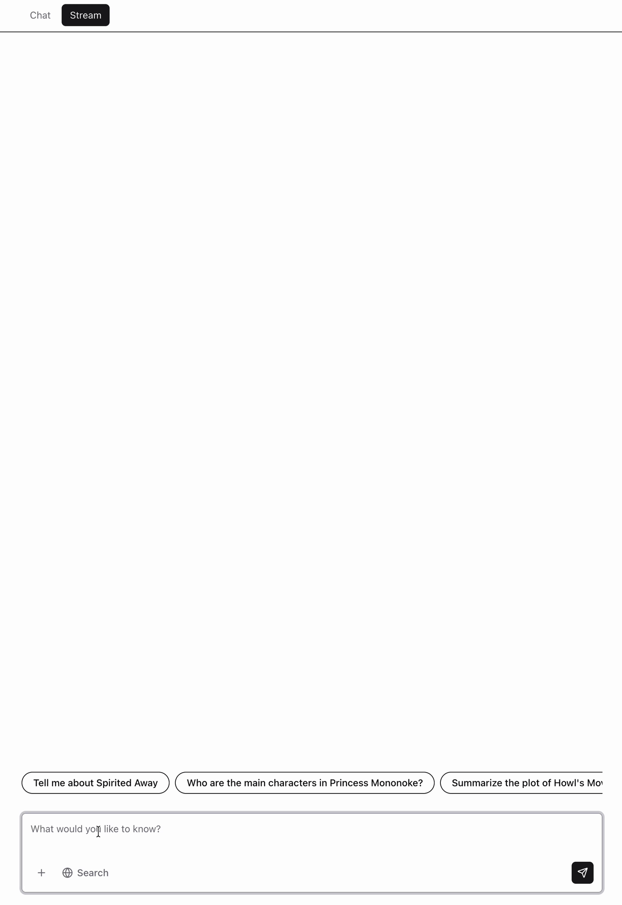

# dbx-tools-appkit

Bun monorepo for `@dbx-tools` AppKit add-ons: shared helpers plus a Mastra
plugin, with a runnable Databricks App demo.

| Package                                       | Path              | Published            |
| --------------------------------------------- | ----------------- | -------------------- |
| [`@dbx-tools/appkit-shared`](packages/shared) | `packages/shared` | yes                  |
| [`@dbx-tools/appkit-mastra`](packages/mastra) | `packages/mastra` | yes                  |
| [`@dbx-tools/appkit-demo`](demo)              | `demo`            | no (`private: true`) |

`appkit-shared` provides small utilities (typed plugin lookup, cookie parsing,
string case helpers, console log prefixes) without pulling AppKit types into
every consumer. `appkit-mastra` is a beta AppKit plugin that mounts Mastra
(`@mastra/express` + `@mastra/ai-sdk` `chatRoute`), resolves the model from the
workspace host and `/serving-endpoints` with per-request user auth, and can
reuse the `lakebase` plugin pool for Mastra Memory when `storage` / `memory`
are enabled. It also exports `buildGenieTools` for wiring the AppKit `genie`
plugin into custom Mastra agents.

### Memory in action

With `storage: true, memory: true`, Mastra persists conversation history into
the `lakebase` Postgres pool and surfaces recent turns as input suggestions on
the next visit:

<p align="center">
  
</p>

## Develop

From the repo root:

```bash
bun install
bun typecheck
bun run build
```

Run the demo against a real workspace:

```bash
cd demo
cp .env.example .env   # DATABRICKS_HOST, serving / Lakebase vars as documented there
databricks auth login --host "$DATABRICKS_HOST"
bun dev                # or `bun dev` from the repo root (`--filter` demo)
```

See [demo/README.md](demo/README.md) for layout, scripts, bundle deploy notes,
and how the client targets `/api/mastra/route/chat/<agentId>`.

## Scaffold a new package

```bash
bun run create plugin <slug>   # AppKit plugin stub under packages/<slug>
bun run create shared <slug>   # types-only package stub
```

## Release

Publishable packages use Changesets. Workspace members under `@dbx-tools/*` are
configured as `fixed` in [`.changeset/config.json`](.changeset/config.json) so
they version together. Add a change:

```bash
bun changeset
# pick packages + bump level, write a one-liner summary
```

On push to `main`, the [release workflow](.github/workflows/release.yml)
opens (and on subsequent pushes merges + publishes) a "Version Packages" PR
that applies the bumps and runs `changeset publish` against npm. To enable
publishes, add an `NPM_TOKEN` repo secret with publish access to the
`@dbx-tools` scope.

## License

Apache-2.0
